# María Vega Psicología


<div align="center">

[](https://astro.build/)
[](https://tina.io/)
[](https://pages.cloudflare.com/)
[](https://tailwindcss.com/)
[](https://www.aepd.es/)
[](#)

Sitio web oficial, plataforma de contenidos y sistema de gestión visual de **María Vega**, Psicóloga General Sanitaria (N.º Colegiada AO-13370) en Málaga.

[🌐 mariavegagarcia.es](https://mariavegagarcia.es) · [🛠️ Panel de Edición (Entorno Dev)](https://dev.maria-vega-psicologa.pages.dev/admin/#/~/)

</div>

---

## 🌟 Características Principales

- **Edición Visual Intuitiva en TinaCMS**: Modificación en vivo directamente sobre la web con resaltado de campos (`data-tina-field`), previsualización instantánea y gestión sin tocar código.
- **Flujo Seguro Dev ➔ Producción**: Entorno de pruebas aislado en Cloudflare Pages (`dev.maria-vega-psicologa.pages.dev`) con un botón nativo en TinaCMS para publicar a producción en 1 clic mediante GitHub Actions.
- **Cumplimiento RGPD / AEPD Riguroso**:
  - Banner de cookies accesible con opciones equivalentes de aceptación y rechazo sin bloqueo.
  - Consentimiento en dos pasos (*Two-Click Consent*) para contenido embebido de terceros (Google Maps).
  - Analítica respetuosa con la privacidad mediante Cloudflare Web Analytics (cero cookies, sin perfiles ni huellas digitales).
  - Páginas legales dedicadas (`/legal/aviso-legal`, `/legal/privacidad`, `/legal/cookies`).
- **Rendimiento y SEO Clínico Optimizado**:
  - Puntuaciones 100/100 en Core Web Vitals y accesibilidad.
  - Datos estructurados Schema.org (`MedicalBusiness`, `Person`, `PsychologicalService`, `FAQPage`, `BreadcrumbList`).
  - Cabeceras de seguridad estrictas: HSTS (`max-age: 63072000; preload`), CSP endurecido, `nosniff`, `same-origin`.
  - Dominio y DNS protegidos con Cloudflare (Bot Fight Mode, Always Use HTTPS, TLS 1.2+, DMARC).

---

## 🏗️ Stack Tecnológico

| Capa | Tecnología | Descripción |
| :--- | :--- | :--- |
| **Framework Web** | [Astro 5](https://astro.build/) | Arquitectura de Islas (*Islands Architecture*) con Static Site Generation (SSG) y endpoints SSR edge. |
| **Gestor de Contenidos** | [TinaCMS 3.13](https://tina.io/) | CMS headless basado en Git, esquemas tipados TypeScript y editor visual in-context. |
| **Diseño y Estilos** | [Tailwind CSS 3.4](https://tailwindcss.com/) | Sistema de diseño sobrio y accesible: paleta botánica (sage, blush, warm) y tipografías Lora & DM Sans. |
| **Infraestructura** | [Cloudflare Pages](https://pages.cloudflare.com/) | Alojamiento global en el Edge con Cloudflare Zero Trust Access para el entorno de desarrollo. |
| **Automatización** | [GitHub Actions](https://github.com/features/actions) | Fusión automática de ramas (`dev` ➔ `main`) mediante disparadores `repository_dispatch`. |
| **Gestor de Paquetes** | [pnpm](https://pnpm.io/) | Gestión eficiente y determinista de dependencias con Node 24. |

---

## 📁 Estructura del Repositorio

```text
├── .github/
│   └── workflows/
│       ├── ci.yml                     # Verificación de build y TypeScript en pull requests
│       └── publish-production.yml     # Flujo automatizado de fusión de dev a main
├── public/
│   ├── _headers                       # Cabeceras HTTP de seguridad (HSTS, CSP, X-Frame-Options)
│   ├── _redirects                     # Reglas de enrutamiento y redirecciones canónicas
│   ├── favicon.png                    # Icono del sitio
│   ├── og-default.jpg                 # Imagen OpenGraph para redes sociales (1200x630)
│   └── images/                        # Imágenes optimizadas de la web y marca
├── src/
│   ├── components/
│   │   ├── islands/                   # Componentes interactivos React (menú móvil, acordeón FAQ)
│   │   ├── layout/                    # Layout principal, Header y Footer
│   │   ├── sections/                  # Secciones modulares de la web (Hero, Enfoque, Servicios, FAQ)
│   │   ├── seo/                       # Componente SeoHead con metadatos y canonicals dinámicos
│   │   └── ui/                        # Componentes UI reutilizables (Botones, CookieBanner, Iconos)
│   ├── content/                       # Fuente única de verdad del contenido en JSON/MDX
│   │   ├── contactPage/               # Configuración de contacto y formulario
│   │   ├── cursos/                    # Cursos clínicos para profesionales
│   │   ├── faq/                       # Preguntas frecuentes dinámicas
│   │   ├── profile/                   # Biografía, trayectoria y acreditación colegial
│   │   ├── recursos/                  # Artículos y recursos psicoeducativos
│   │   ├── servicesPage/              # Textos e información de la página general de servicios
│   │   ├── servicios/                 # Páginas de especialidades clínicas
│   │   └── siteSettings/              # Ajustes globales de marca, teléfono, horarios y enlaces
│   ├── lib/                           # Configuraciones de sitio, helpers de imagen y JSON-LD
│   └── pages/                         # Rutas públicas y API endpoints (/api/publish, /api/contact)
├── tina/
│   ├── collections/                   # Esquemas tipados de cada colección de contenido
│   ├── plugins/                       # Plugin de publicación a producción en TinaCMS
│   └── config.ts                      # Configuración central del cliente y build de Tina
└── astro.config.mjs                   # Configuración del motor Astro y adaptadores
```

---

## 🚀 Flujo de Trabajo: Edición y Publicación

El proyecto sigue una estrategia de ramas protegida para garantizar que ningún cambio inacabado afecte a la web pública:

```mermaid
flowchart LR
    A[Editora en TinaCMS dev] -->|Guarda contenido| B[Rama dev en GitHub]
    B -->|Despliegue automático| C[dev.maria-vega-psicologa.pages.dev]
    C -->|Revisión visual conforme| D[Botón: Publicar a Producción]
    D -->|Llamada /api/publish| E[GitHub Actions Dispatch]
    E -->|Fusión automática| F[Rama main en GitHub]
    F -->|Despliegue a Producción| G[mariavegagarcia.es]
```



1. **Edición en Pruebas**: La psicóloga accede a `https://dev.maria-vega-psicologa.pages.dev/admin/#/~/` y realiza cambios con previsualización en vivo. Al guardar, los cambios se confirman en la rama `dev`.
2. **Revisión**: Comprueba que los textos, fotos y servicios queden perfectos en el entorno `dev`.
3. **Publicación en un Clic**: Pulsa el botón **Publicar a Producción** en la barra lateral de Tina y confirma con **✓ Sí, publicar ahora**. GitHub Actions fusiona automáticamente la rama `dev` en `main` y Cloudflare despliega la web oficial en menos de 2 minutos.

---

## 💻 Desarrollo Local

### Requisitos Previos
- **Node.js** `>= 24.0.0`
- **pnpm** `>= 10.0.0`

### Instalación y Ejecución

```bash
# 1. Clonar el repositorio
git clone https://github.com/darmmar/maria-vega-psicologa.git
cd maria-vega-psicologa

# 2. Instalar dependencias
pnpm install

# 3. Iniciar entorno de desarrollo completo (Astro + TinaCMS)
pnpm run dev
```

La web estará disponible en [http://localhost:4321](http://localhost:4321) y el panel local en [http://localhost:4321/admin/#/~/](http://localhost:4321/admin/#/~/).

### Scripts Disponibles

| Comando | Descripción |
| :--- | :--- |
| `pnpm run dev` | Inicia el servidor de Astro junto con el compilador local de TinaCMS. |
| `pnpm run build` | Valida esquemas, compila assets estáticos y genera el bundle de producción. |
| `pnpm run typecheck` | Ejecuta `astro check` para asegurar 0 errores de tipado en TypeScript y Astro. |
| `pnpm run preview` | Previsualiza localmente la compilación de producción generada en `dist/`. |

---

## 🔐 Variables de Entorno

Copia el archivo `.env.example` a `.env.local` para configurar las variables locales:

| Variable | Tipo | Descripción |
| :--- | :--- | :--- |
| `PUBLIC_SITE_URL` | Público | URL canónica de la web (`https://mariavegagarcia.es` en producción). |
| `PUBLIC_TINA_BRANCH` | Público | Rama de trabajo de Tina (`dev` o `main`). |
| `PUBLIC_TINA_CLIENT_ID` | Público | Client ID obtenido en el proyecto de Tina Cloud. |
| `TINA_TOKEN` | Secreto | Token de lectura/escritura para la API GraphQL de Tina Cloud. |
| `GITHUB_DISPATCH_TOKEN` | Secreto | Personal Access Token de GitHub con permisos de repositorio para desencadenar la publicación. |

---

## ⚖️ Licencia y Propiedad

© 2026 **María Vega Psicología**. Todos los derechos reservados. El código fuente, diseño gráfico y contenidos textuales son propiedad exclusiva de María del Rocío Vega García.
